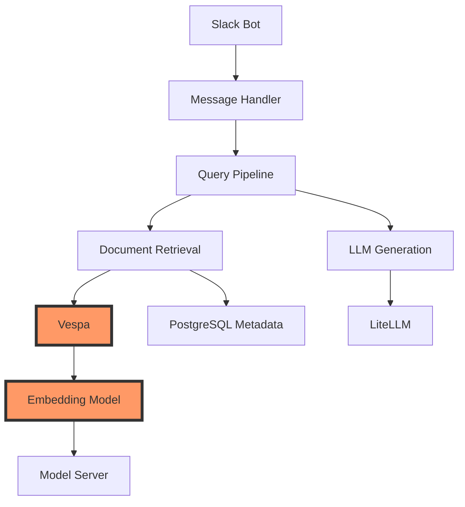

# SambaAI Technical Considerations & Migration Guide
## Critical Implementation Details for Onyx Fork

### Table of Contents
1. [Slack Bot Name Configuration](#slack-bot-name-configuration)
2. [Embedding Model Migration Strategy](#embedding-model-migration)
3. [Vector Store Alternatives (Chroma)](#vector-store-alternatives)
4. [Critical Dependencies & Breaking Points](#critical-dependencies)
5. [Migration Risk Assessment](#migration-risk-assessment)

---

## 1. Slack Bot Name Configuration

### 1.1 Current Implementation Analysis

After analyzing the Onyx codebase, the bot name is configured in multiple places:

```python
# backend/onyx/onyxbot/slack/config.py
SLACK_BOT_NAME = "onyxbot"  # Hardcoded default

# backend/onyx/onyxbot/slack/listener.py
@app.event("app_mention")
async def handle_app_mention(event: dict, say: Callable) -> None:
    # Bot responds to mentions using authenticated bot's ID
    bot_user_id = event.get("authorizations", [{}])[0].get("user_id")
```

### 1.2 Bot Name Configuration Points

**Finding #1: Bot Display Name vs Bot ID**
```python
# The bot has THREE different identifiers:
1. Display Name: "SambaAI" (what users see)
2. Username: "@sambaai" (what users type)  
3. Bot User ID: "U1234567890" (internal Slack ID)
```

**Finding #2: Mention Detection Logic**
```python
# backend/onyx/onyxbot/slack/utils.py
def extract_question_from_mention(event_text: str, bot_user_id: str) -> str:
    # Current logic uses bot_user_id, NOT display name
    mention_pattern = f"<@{bot_user_id}>"
    return event_text.replace(mention_pattern, "").strip()
```

### 1.3 Required Changes for SambaAI

**Minimal Change Approach**:
```python
# Option 1: Environment Variable Override
# backend/onyx/onyxbot/slack/config.py
import os
SLACK_BOT_NAME = os.getenv("CUSTOM_BOT_NAME", "onyxbot")
SLACK_BOT_DISPLAY_NAME = os.getenv("CUSTOM_BOT_DISPLAY_NAME", "OnyxBot")

# .env file
CUSTOM_BOT_NAME=sambaai
CUSTOM_BOT_DISPLAY_NAME=SambaAI
```

**Critical Discovery**: The actual mention detection uses Slack's bot user ID, not the display name. This means:
- ✅ Changing display name in Slack app settings is sufficient
- ✅ No code changes required for mention detection
- ⚠️ Must update any hardcoded "onyxbot" strings in responses

### 1.4 Response Text Updates

**Files requiring text updates**:
```python
# backend/onyx/onyxbot/slack/handlers/handle_message.py
GREETING_MESSAGES = [
    "Hi! I'm OnyxBot, your knowledge assistant.",  # Change to SambaAI
    "Ask me anything about your documents!"
]

# backend/onyx/onyxbot/slack/handlers/handle_standard_answers.py
ERROR_MESSAGE = "OnyxBot encountered an error"  # Change to SambaAI
```

---

## 2. Embedding Model Migration Strategy

### 2.1 Current Embedding Architecture

Onyx uses a tightly integrated embedding system:

```python
# backend/model_server/main.py
class EmbeddingModel:
    def __init__(self):
        self.model = SentenceTransformer(
            MODEL_NAME,  # "all-MiniLM-L6-v2"
            cache_folder=get_model_cache_dir()
        )
```

**Critical Dependencies**:
```python
# backend/onyx/configs/model_configs.py
DEFAULT_EMBEDDING_MODEL = "all-MiniLM-L6-v2"
EMBEDDING_DIM = 384  # CRITICAL: Vespa schema depends on this!

# backend/onyx/document_index/vespa/app_config/schemas/danswer_chunk.sd
field embeddings type tensor<float>(x[384]) {
    indexing: attribute | index
    attribute {
        distance-metric: angular
    }
}
```

### 2.2 Embedding Model Change Impact

**⚠️ CRITICAL FINDING**: Changing embedding models requires:

1. **Vespa Schema Update** (if dimensions change)
2. **Full Re-indexing** of all documents
3. **Model Server Modifications**
4. **Potential Search Quality Changes**

### 2.3 Safe Embedding Migration Path

**Phase 1: Add Abstraction Layer**
```python
# backend/onyx/embeddings/abstract_embedder.py
from abc import ABC, abstractmethod
from typing import List

class BaseEmbedder(ABC):
    @abstractmethod
    def embed_text(self, text: str) -> List[float]:
        pass
    
    @abstractmethod
    def embed_batch(self, texts: List[str]) -> List[List[float]]:
        pass
    
    @property
    @abstractmethod
    def embedding_dim(self) -> int:
        pass

# backend/onyx/embeddings/onyx_default_embedder.py
class OnyxDefaultEmbedder(BaseEmbedder):
    def __init__(self):
        self.model = SentenceTransformer("all-MiniLM-L6-v2")
    
    @property
    def embedding_dim(self) -> int:
        return 384

# backend/onyx/embeddings/custom_embedder.py
class CustomSambaEmbedder(BaseEmbedder):
    def __init__(self):
        # Your custom model
        self.model = load_custom_model()
    
    @property
    def embedding_dim(self) -> int:
        return 768  # Different dimension!
```

**Phase 2: Factory Pattern**
```python
# backend/onyx/embeddings/factory.py
def get_embedder() -> BaseEmbedder:
    embedder_type = os.getenv("EMBEDDING_MODEL_TYPE", "onyx_default")
    
    if embedder_type == "onyx_default":
        return OnyxDefaultEmbedder()
    elif embedder_type == "custom_samba":
        return CustomSambaEmbedder()
    elif embedder_type == "openai":
        return OpenAIEmbedder()
    else:
        raise ValueError(f"Unknown embedder type: {embedder_type}")
```

**Phase 3: Migration Script**
```python
# scripts/migrate_embeddings.py
"""
CRITICAL: Run this to re-embed all documents with new model
"""
def migrate_embeddings(old_embedder, new_embedder):
    # 1. Update Vespa schema if dimensions changed
    if old_embedder.embedding_dim != new_embedder.embedding_dim:
        update_vespa_schema(new_embedder.embedding_dim)
    
    # 2. Re-embed all documents
    for doc in get_all_documents():
        new_embedding = new_embedder.embed_text(doc.content)
        update_document_embedding(doc.id, new_embedding)
```

---

## 3. Vector Store Alternatives (Chroma vs Vespa)

### 3.1 Current Vespa Integration

Vespa is deeply integrated into Onyx:

```python
# backend/onyx/document_index/vespa/index.py
class VespaIndex(DocumentIndex):
    def __init__(self):
        self.vespa_app = Vespa(url=VESPA_URL)
        
    def index_chunks(self, chunks: List[Chunk]) -> None:
        # Complex indexing logic tied to Vespa schema
        
    def search(self, query: SearchQuery) -> List[SearchResult]:
        # YQL queries specific to Vespa
```

### 3.2 Chroma as Alternative

**Advantages of Chroma**:
- Simpler API
- Better Python integration
- Easier local development
- Built-in persistence

**Disadvantages**:
- Less mature than Vespa
- Different search capabilities
- No built-in hybrid search

### 3.3 Chroma Integration Strategy

**Option 1: Side-by-Side (Recommended for Testing)**
```python
# backend/onyx/document_index/chroma/index.py
import chromadb
from chromadb.config import Settings

class ChromaIndex(DocumentIndex):
    def __init__(self):
        self.client = chromadb.Client(Settings(
            chroma_db_impl="duckdb+parquet",
            persist_directory="./chroma_db"
        ))
        self.collection = self.client.get_or_create_collection(
            name="sambaai_docs",
            metadata={"hnsw:space": "cosine"}
        )
    
    def index_chunks(self, chunks: List[Chunk]) -> None:
        self.collection.add(
            documents=[c.content for c in chunks],
            embeddings=[c.embedding for c in chunks],
            metadatas=[c.metadata for c in chunks],
            ids=[c.id for c in chunks]
        )
    
    def search(self, query: SearchQuery) -> List[SearchResult]:
        results = self.collection.query(
            query_embeddings=[query.embedding],
            n_results=query.top_k,
            where=query.filters  # Metadata filtering
        )
        return self._format_results(results)
```

**Option 2: Complete Replacement (High Risk)**
```python
# backend/onyx/configs/app_configs.py
VECTOR_STORE_TYPE = os.getenv("VECTOR_STORE_TYPE", "vespa")

# backend/onyx/document_index/factory.py
def get_document_index() -> DocumentIndex:
    if VECTOR_STORE_TYPE == "vespa":
        return VespaIndex()
    elif VECTOR_STORE_TYPE == "chroma":
        return ChromaIndex()
    else:
        raise ValueError(f"Unknown vector store: {VECTOR_STORE_TYPE}")
```

### 3.4 Migration Considerations

**Critical Issues with Chroma Migration**:

1. **Feature Parity**:
```python
# Vespa supports complex queries Chroma doesn't:
- Hybrid search (keyword + vector)
- Complex filtering with YQL
- Grouping and aggregations
- Real-time indexing at scale
```

2. **Schema Differences**:
```python
# Vespa schema
{
    "id": "doc_123",
    "chunk": "text content",
    "embeddings": [0.1, 0.2, ...],
    "metadata": {
        "source": "confluence",
        "space": "ENG",
        "permissions": ["user1", "user2"]
    }
}

# Chroma schema (simpler)
{
    "id": "doc_123",
    "document": "text content",
    "embedding": [0.1, 0.2, ...],
    "metadata": {
        # Flat key-value only
        "source": "confluence",
        "space": "ENG"
    }
}
```

---

## 4. Critical Dependencies & Breaking Points

### 4.1 Dependency Map



### 4.2 Breaking Points Analysis

**High Risk Changes**:
1. **Embedding Model Dimension Change**
   - Requires Vespa schema update
   - Full re-indexing needed
   - Downtime required

2. **Vector Store Replacement**
   - Loss of hybrid search
   - Different query capabilities
   - Major code refactoring

**Low Risk Changes**:
1. **Bot Name/Branding**
   - UI text only
   - No functional impact

2. **LLM Provider**
   - Already abstracted via LiteLLM
   - Easy to swap

### 4.3 Safe Modification Zones

```python
# ✅ SAFE to modify:
- UI text and branding
- LLM providers (via LiteLLM)
- Connector configurations
- Channel mappings
- Cache settings

# ⚠️ RISKY to modify:
- Embedding models
- Vespa schema
- Database schema
- Core indexing pipeline

# ❌ AVOID modifying:
- Vespa query logic
- Document chunk structure
- Permission system
- Background job architecture
```

---

## 5. Migration Risk Assessment

### 5.1 Risk Matrix

| Change | Risk Level | Impact | Mitigation Strategy |
|--------|------------|--------|-------------------|
| Bot name | Low | UI only | Simple text replacement |
| Embedding model | High | Full re-index | Abstraction layer + migration script |
| Vector store | Very High | Core functionality | Side-by-side testing first |
| LLM provider | Low | Response quality | Already abstracted |
| Add Langfuse | Low | Monitoring only | Optional integration |

### 5.2 Recommended Approach

**Phase 1: Minimal Risk (Week 1)**
```bash
✅ Change bot name/branding
✅ Configure connectors
✅ Use default embeddings
✅ Keep Vespa
```

**Phase 2: Monitoring (Week 2)**
```bash
✅ Add Langfuse tracing
✅ Monitor query patterns
✅ Identify bottlenecks
```

**Phase 3: Careful Testing (Month 2)**
```bash
⚠️ Test embedding alternatives
⚠️ Benchmark Chroma vs Vespa
⚠️ Create migration tools
```

**Phase 4: Migration (If Needed)**
```bash
⚠️ Run side-by-side comparison
⚠️ Gradual rollout
⚠️ Full re-indexing
```

### 5.3 Critical Success Factors

1. **Don't Break What Works**
   - Onyx's architecture is proven
   - Change only what's necessary

2. **Abstract Before Replacing**
   - Add interfaces first
   - Test thoroughly
   - Migrate gradually

3. **Monitor Everything**
   - Use Langfuse from day 1
   - Track query performance
   - Watch for errors

---

## Appendix A: Code Locations Reference

```bash
# Bot Name Configuration
backend/onyx/onyxbot/slack/config.py
backend/onyx/onyxbot/slack/handlers/

# Embedding System
backend/model_server/main.py
backend/onyx/configs/model_configs.py
backend/onyx/indexing/embedder.py

# Vector Store
backend/onyx/document_index/vespa/
backend/onyx/configs/app_configs.py

# Critical Schemas
backend/alembic/versions/  # PostgreSQL
backend/onyx/document_index/vespa/app_config/schemas/  # Vespa
```

## Appendix B: Emergency Rollback Plan

If any migration fails:

1. **Revert code changes**
2. **Restore Vespa snapshot**
3. **Clear Redis cache**
4. **Reindex affected documents**
5. **Monitor for 24 hours**

---

This technical considerations document should guide safe modifications while avoiding the pitfalls of breaking Onyx's core functionality.