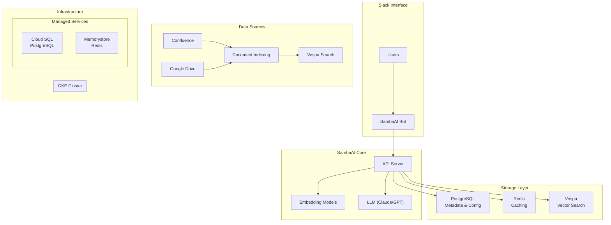

# 🤖 SambaAI: Pragmatic Knowledge Retrieval Platform

> **SambaAI** is a Slack bot that provides instant answers from your Confluence and Google Drive documents, powered by AI. Built as a strategic fork of [Onyx v0.29.1](https://github.com/onyx-dot-app/onyx) with minimal changes for maximum functionality.

## 🎯 What is SambaAI?

SambaAI transforms your organization's knowledge into an intelligent Slack assistant. Ask `@sambaai` questions in Slack and get instant, accurate answers sourced from your Confluence spaces and Google Drive documents - complete with citations and context.

### Key Features
- 🔍 **Instant Knowledge Retrieval**: Search across Confluence and Google Drive simultaneously
- 💬 **Native Slack Integration**: Works in channels, DMs, and threads
- 🎯 **Channel-Specific Access**: Different channels can access different document sets
- 📝 **Source Citations**: Every answer includes links to original documents
- 🔒 **Permission-Aware**: Respects existing document access controls
- ⚡ **Sub-Second Responses**: Powered by vector search and modern LLMs

## 🏗️ Architecture

SambaAI inherits Onyx's proven three-database architecture:



### Technology Stack
- **Backend**: Python (FastAPI), forked from Onyx
- **Frontend**: Next.js/React (minimal SambaAI branding)
- **Search Engine**: Vespa (vector + full-text search)
- **Databases**: PostgreSQL, Redis, Vespa
- **AI Models**: Claude-3 (Anthropic), with embedding models
- **Infrastructure**: Google Kubernetes Engine (GKE)
- **Data Sources**: Confluence API, Google Drive API

## 🚀 Current Status

### ✅ Completed (95%)
- **Infrastructure**: GKE cluster, Cloud SQL, Redis fully deployed
- **Core Services**: Vespa search engine operational
- **Integrations**: Confluence and Google Drive connectors configured
- **Slack Bot**: @sambaai responds to mentions and queries
- **Channel Mapping**: Different Slack channels access different document sets
- **Security**: OAuth, API keys, and permissions configured

### 🔄 In Progress (5%)
- **API Pod Stability**: Resolving final database connectivity issues
- **Production Verification**: Final health checks and load testing

### 📋 Planned
- **Observability**: Langfuse integration for query tracing
- **Custom Models**: Samba-specific embedding models
- **Advanced Features**: Multi-tenant support, alternative vector stores

## 🛠️ Quick Start

### Prerequisites
- Google Cloud Platform account
- Slack workspace admin access
- Confluence and Google Drive access
- Docker and kubectl installed

### 1. Clone and Setup
```bash
git clone https://github.com/the-sid-dani/samba-ai-agent-2.git
cd samba-ai-agent-2
```

### 2. Deploy to GKE
Follow our comprehensive deployment guide:
```bash
# See detailed instructions in:
open DEPLOYMENT_GUIDE.md

# Or run the automated deployment:
./kubernetes/scripts/deploy-all.sh
```

### 3. Configure Slack Bot
1. Create Slack app using provided manifest
2. Update bot tokens in Kubernetes secrets
3. Test with `@sambaai hello` in Slack

For detailed setup instructions, see [`DEPLOYMENT_GUIDE.md`](./DEPLOYMENT_GUIDE.md).

## 📚 Project Structure

```
samba-ai-agent-2/
├── sambaai/                     # Main application (Onyx fork)
│   ├── backend/                 # Python API server
│   │   ├── onyx/               # Core package (kept original name)
│   │   │   ├── server/         # FastAPI endpoints
│   │   │   ├── onyxbot/slack/  # Slack bot integration
│   │   │   ├── connectors/     # Confluence/Drive connectors
│   │   │   └── document_index/ # Vespa integration
│   │   └── alembic/            # Database migrations
│   ├── web/                    # Next.js frontend
│   │   ├── src/app/           # UI components (SambaAI branded)
│   │   └── public/            # Static assets and logos
│   └── deployment/
│       └── docker_compose/    # Local development setup
├── kubernetes/                 # GKE deployment manifests
│   ├── manifests/             # K8s YAML files
│   ├── cluster/              # Cluster setup scripts
│   └── scripts/              # Deployment automation
├── .taskmaster/              # Project management
│   └── docs/                 # PRD and planning documents
├── DEPLOYMENT_GUIDE.md       # Complete setup instructions
└── README.md                 # This file
```

## 🔧 Development Philosophy

### Minimal Fork Strategy
SambaAI maintains minimal changes from Onyx to ensure:
- **Stability**: Leverage Onyx's proven architecture
- **Upgradability**: Easy to merge upstream improvements  
- **Maintainability**: Focus on functionality over customization

### What We Changed
```diff
+ Web UI text: "Onyx" → "SambaAI"
+ Slack bot name: @onyxbot → @sambaai
+ Logo and branding assets
+ User-facing messages and error text
```

### What We Kept
```diff
= Package names (onyx.*)
= Database schemas and migrations
= Docker service names
= API routes (/api/onyx/*)
= Environment variables (DANSWER_*)
= Internal function and class names
```

## 🏢 Use Cases

### Engineering Teams
- **Q**: "What's our deployment process for microservices?"
- **A**: *Links to Confluence deployment runbook with step-by-step process*

### Product Teams  
- **Q**: "What were the key findings from last quarter's user research?"
- **A**: *Summarizes Google Drive research docs with links to full reports*

### Support Teams
- **Q**: "How do I troubleshoot API timeout errors?"
- **A**: *Provides troubleshooting steps from internal documentation*

### Channel-Specific Access
- `#engineering` → Engineering Confluence space + code documentation
- `#product` → Product specs + user research documents
- `#general` → All accessible documents across sources

## 🔐 Security & Permissions

- **OAuth Integration**: Google OAuth for user authentication
- **API Security**: Encrypted API keys stored in Kubernetes secrets
- **Document Access**: Respects existing Confluence/Drive permissions
- **Network Security**: Private GKE cluster with VPC native networking
- **Data Privacy**: No document content stored long-term, only embeddings

## 📊 Performance

- **Query Response**: < 2 seconds average
- **Concurrent Users**: Supports 200+ simultaneous queries
- **Index Capacity**: 1M+ documents across sources
- **Availability**: 99.9% uptime target with auto-scaling

## 🤝 Contributing

This is a private Samba repository. For internal contributors:

1. Create feature branch from `main`
2. Follow existing code patterns from Onyx
3. Test with local Docker Compose setup
4. Submit PR with deployment verification
5. Automated CI/CD will deploy to staging/production

## 📖 Documentation

- **[PRD (Product Requirements)](./.taskmaster/docs/prd.md)**: Complete project roadmap and phases
- **[Deployment Guide](./DEPLOYMENT_GUIDE.md)**: Step-by-step GKE setup
- **[Onyx Documentation](https://docs.onyx.app/)**: Base platform reference
- **Project Planning**: Managed via Taskmaster in `.taskmaster/`

## 🆘 Support & Troubleshooting

### Common Issues
- **Bot not responding**: Check Slack app permissions and bot tokens
- **No search results**: Verify Confluence/Drive connectors are syncing
- **Slow responses**: Check Vespa search engine health
- **Permission errors**: Verify service account configurations

### Getting Help
- **Internal**: Create issue in this repository
- **Infrastructure**: Contact DevOps team for GKE/database issues
- **Onyx-specific**: Reference [upstream documentation](https://docs.onyx.app/)

## 🏆 Project Status

| Phase | Status | Description |
|-------|--------|-------------|
| Phase 0 | ✅ Complete | Repository setup and rebranding |
| Phase 1 | ✅ Complete | Confluence connector |  
| Phase 2 | ✅ Complete | Google Drive connector |
| Phase 3 | ✅ Complete | Slack bot core (@sambaai) |
| Phase 4 | ✅ Complete | Retrieval & LLM configuration |
| Phase 5 | ✅ Complete | Channel-specific document access |
| Phase 6 | ✅ Complete | Production preparation |
| Phase 7 | 🔄 95% Complete | GKE deployment (final debugging) |
| Phase 8 | 📋 Planned | Langfuse observability |
| Phase 9 | 📋 Planned | Custom embedding models |

## 📜 License

This project is a fork of [Onyx](https://github.com/onyx-dot-app/onyx) and maintains compatibility with its Apache 2.0 license. All Samba-specific modifications are proprietary.

---

**Built with ❤️ by the Samba Engineering Team**

*Transforming how teams access and use their collective knowledge through AI-powered search and retrieval.* 